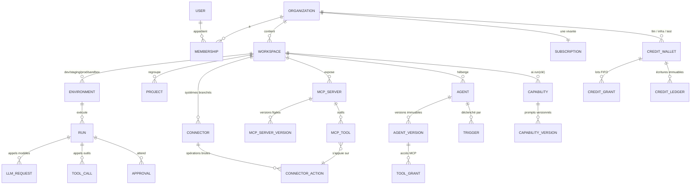

# Schéma de données — v1.2

> **Cible :** PostgreSQL 18 + pgvector · **Nom de code :** `project-cp`
> **Statut :** appliqué et testé sur PostgreSQL 18.6 (23 contrôles d'intégrité et d'isolation passés).
> **Fichiers :** `schema/000_…960_*.sql` (à appliquer dans l'ordre avec `run_all.sh`), tests dans `schema/tests/` (sur base neuve). Migrations et ORM : voir `03-architecture-technique.md` §3.
> Date : 29 septembre 2026.

---

## 1. Chiffres clés

| Élément | Valeur |
|---|---|
| Domaines (schémas PostgreSQL) | 15 |
| Tables | 183 (dont 9 partitionnées par mois) |
| Clés étrangères | 389 — **toutes indexées** (vérifié automatiquement) |
| Tables sous Row-Level Security | 110 |
| Politiques RLS | 141 |
| Index redondants | 0 (vérifié automatiquement) |
| Codes d'erreur initiaux | 62 (bilingues) |
| Droits de plan | 40 × 8 plans |

---

## 2. Conventions

### 2.1 Identifiants hybrides
| Colonne | Type | Usage |
|---|---|---|
| `id` | `bigint GENERATED ALWAYS AS IDENTITY` | Clé primaire **interne** : relations, jointures, index compacts |
| `public_id` | `uuid DEFAULT uuidv7()` | Identifiant **externe** : API, URL, SDK, webhooks |

- Un `bigint` n'est **jamais** exposé à l'extérieur.
- **UUIDv7** : ordonné dans le temps (bonne localité d'index) et contient sa date de création (`uuid_extract_timestamp`).
- Tables de liaison pures (ex. `role_permissions`) : clé primaire composite, pas de `public_id`.
- Côté API, le type peut être préfixé à l'affichage (`run_…`, `agt_…`) ; la base ne stocke que l'UUID.

### 2.2 Multi-tenant
- Toute table client porte `organization_id` (dénormalisé, même quand on pourrait le déduire).
- **Clés étrangères composites** `(x_id, organization_id) → (id, organization_id)` : la base rend **impossible** un lien entre deux clients, même en cas de bug applicatif (test T1).
- **Row-Level Security** : `organization_id = util.current_org_id()`. Sans contexte, aucune ligne n'est visible (refus par défaut, test T11).
- L'application pose le contexte à chaque transaction :
  ```sql
  SET LOCAL app.org_id = '42';
  SET LOCAL app.user_id = '7';
  ```

### 2.3 Autres conventions
| Sujet | Convention |
|---|---|
| Argent | `amount_minor bigint` + `currency char(3)` (XAF = 0 décimale, EUR = 2) |
| Crédits | `…_micro bigint` : 1 crédit = 1 000 000 µcr |
| Statuts | `text` + `CHECK` (modifiable par migration, contrairement aux ENUM) |
| Libellés traduisibles | `jsonb {"fr": "…", "en": "…"}` validé par `util.is_i18n` |
| Dates | `timestamptz` partout ; `updated_at` maintenu par trigger |
| Suppression | `deleted_at` (soft delete) ; unicités en index partiels `WHERE deleted_at IS NULL` |
| Concurrence | `lock_version` incrémenté par trigger → `UPDATE … WHERE id = $1 AND lock_version = $2` |
| Périodes de prix | `tstzrange` + contrainte d'exclusion : **aucun chevauchement possible** |
| Secrets | jamais en base : seulement le chemin dans le coffre (Infisical), une version et une empreinte |
| Jetons / clés | seulement le **hash** (`bytea`) + un préfixe affichable |

---

## 3. Domaines

| Schéma | Rôle | Tables |
|---|---|---|
| `ref` | Référentiels | currencies, languages, data_regions, countries, fx_rates, tax_rates |
| `iam` | Identité, organisations, accès, OAuth | users, user_identities, user_mfa_factors, user_sessions, verification_tokens, organizations, permissions, roles, role_permissions, memberships, invitations, teams, team_members, workspaces, workspace_members, environments, projects, secrets, oauth_clients, oauth_consents, oauth_authorization_codes, oauth_tokens |
| `storage` | Métadonnées des fichiers (binaire en stockage objet) et backends de stockage (D52) | backends, files, backend_migrations |
| `billing` | Plans, droits, abonnements, crédits, paiements, factures, budgets, promotions | plans, plan_prices, features, plan_features, organization_feature_overrides, subscriptions, subscription_events, credit_wallets, credit_grants, **credit_ledger\***, credit_reservations, credit_packs, credit_pack_prices, infra_meters, infra_meter_rates, payment_providers, payment_methods, payments, payment_events, refunds, invoice_sequences, invoices, invoice_lines, budgets, budget_periods, coupons, coupon_redemptions, referrals |
| `ai` | Fournisseurs, modèles, prix, routage, BYOK, capacités, évaluations, **garde-fous** | guardrail_detectors, guardrail_profiles, guardrail_rules, guardrail_bindings, providers, provider_accounts, provider_account_snapshots, models, model_deployments, model_prices, routing_profiles, routing_rules, routing_rule_targets, byok_keys, capabilities, capability_versions, capability_releases, capability_release_variants, eval_datasets, eval_cases, eval_runs, eval_results |
| `mcp` | Connecteurs, actions, serveurs, versions, outils, jetons | connector_definitions, oauth_connections, bridges, connectors, connector_credentials, connector_sources, connector_actions, file_datasets, servers, server_versions, tools, tool_embeddings, resources, prompts, access_tokens, access_token_tools, health_checks |
| `agent` | Agents, versions, droits, déclencheurs, approbations, mémoire, chat | agents, versions, tool_grants, **capability_grants**, triggers, approvals, memories, conversations, messages |
| `usage` | Traçabilité et consommation | **runs\***, **run_steps\***, **llm_requests\***, **tool_calls\***, **guardrail_events\***, daily_rollups |
| `dev` | Surface développeur | api_keys, end_users, webhook_endpoints, **inbound_events\***, webhook_subscriptions, **webhook_deliveries\***, outbox_events, idempotency_keys, device_authorizations |
| `market` | Marketplace | publishers, categories, listings, listing_versions, bundle_items, listing_prices, entitlements, installations, reviews, payouts, earnings |
| `ux` | Ce que le frontend sauvegarde | user_preferences, ui_states, saved_views, drafts, onboarding_progress, dashboards |
| `notif` | Notifications | notifications, preferences, deliveries |
| `compliance` | Légal, RGPD, loi 2024/017 | legal_documents, legal_acceptances, cookie_consents, data_subject_requests, processing_activities, subprocessors, transfer_authorizations, data_breaches |
| `platform` | Back-office | emergency_stops, staff_users, staff_roles, staff_permissions, staff_role_permissions, staff_user_roles, staff_sessions, staff_api_keys, impersonation_sessions, staff_notes, settings, settings_history, maintenance_windows, feature_flags, feature_flag_overrides, api_versions, rate_limit_policies, service_accounts, error_codes, message_templates, translations, announcements, announcement_dismissals, status_components, incidents, incident_updates, support_tickets, support_messages, moderation_reports, moderation_actions, abuse_signals, blocklist_entries |
| `audit` | Journal immuable | **events\*** |

\* = partitionnée par mois.

---

## 4. Relations principales



**Chaîne de traçabilité des coûts :**
`organization → workspace → environment → project → run → llm_request / tool_call → credit_ledger`
Chaque requête garde le déploiement utilisé, le coût fournisseur en USD, le taux de change (`fx_rate_id`) et le coefficient appliqués. On peut ainsi répondre à « pourquoi 37 420 crédits ce mois-ci ? » à n'importe quelle maille, avec `usage.daily_rollups` pour les tableaux de bord rapides.

---

## 5. Stratégie d'index

1. **Toutes les clés étrangères sont indexées**, colonnes FK en tête d'index, y compris les FK composites. Un contrôle SQL automatique le vérifie (0 manquante).
2. **Index composites orientés requêtes :** `(organization_id, created_at DESC)`, `(workspace_id, environment_id, created_at DESC)` pour les listes et tableaux de bord.
3. **Index partiels** sur les files de travail, petits et rapides :
   - runs actifs ;
   - runs non facturés ;
   - approbations en attente et leur expiration ;
   - paiements non réconciliés et non encaissés ;
   - webhooks à relancer ;
   - outbox non publiée ;
   - renouvellements d'abonnement ;
   - déclencheurs à exécuter ;
   - contrôles de santé dus.
4. **Unicités métier en index partiels :** une souscription vivante par organisation, un moyen de paiement par défaut, un modèle de message actif par langue, une mise en production active par capacité et environnement.
5. **Recherche :**
   - trigram (`pg_trgm`) sur noms, emails et organisations (back-office) ;
   - `tsvector` généré sur la Marketplace ;
   - GIN sur les tableaux (tags, capacités des modèles, événements).
6. **Vectoriel :** HNSW (cosinus) sur les embeddings des outils (tool routing) et la mémoire des agents.
7. **Aucun index redondant :** contrôle automatique du préfixe (0 trouvé).

---

## 6. Partitionnement et rétention

| Table | Clé | Pourquoi |
|---|---|---|
| `usage.runs`, `run_steps`, `llm_requests`, `tool_calls`, `guardrail_events` | `created_at` | Volume le plus élevé |
| `billing.credit_ledger` | `occurred_at` | Une écriture par débit |
| `dev.inbound_events`, `dev.webhook_deliveries` | `received_at` / `created_at` | Flux entrants et sortants |
| `audit.events` | `occurred_at` | Journal complet |

- Partitions **mensuelles** créées par `util.ensure_monthly_partitions()` : job quotidien, 3 mois d'avance. Une partition par défaut sert de filet de sécurité et doit rester vide (surveillée).
- **Rétention** : les vieilles partitions sont **détachées** puis archivées ou supprimées, sans `DELETE` massif. Pour cette raison, **aucune clé étrangère ne pointe vers une table partitionnée** ; les références (`run_id` + `run_created_at`) sont vérifiées par l'application.
- **Recherche par identifiant public :** `usage.find_run(uuid)` déduit la date de l'UUIDv7 et ne lit que la bonne partition (test T7).
- **Analytique longue durée :** copie vers ClickHouse via l'outbox.

---

## 7. Sécurité en base

### 7.1 Rôles
| Rôle | Utilisé par | RLS |
|---|---|---|
| `app_rw` | API, runtime MCP, workers clients | **soumis** |
| `app_auth` | Résolution des clés API, jetons, sessions (avant de connaître l'organisation) | contournée, droits minimaux sur ces seules tables |
| `app_admin` | Back-office, jobs système (facturation, purge, partitions) | contournée |
| `app_readonly` | Analytique, export ClickHouse | contournée, lecture seule |

- Les partitions ne sont accessibles **que via la table parente**, sinon la RLS pourrait être contournée en lisant une partition directement.
- `app_rw` n'a **aucun droit d'écriture** sur les catalogues (plans, prix, modèles, fournisseurs) ni d'accès aux comptes fournisseurs.

### 7.2 Politiques particulières
- **Rôles système et profils de routage** (`organization_id NULL`) : lisibles par tous, modifiables par personne via `app_rw`.
- **Organisations et adhésions** : un utilisateur voit les organisations dont il est membre sans contexte (sélecteur d'organisation, test T15).
- **Marketplace** : les fiches, éditeurs et avis publiés sont publics ; le reste reste privé.
- **Frontend** (`ux`, `notif`) : filtrage par utilisateur ; vues et tableaux de bord partagés visibles par l'organisation.
- **Support** : un client voit ses tickets, jamais les notes internes.
- **Paramètres** : `app_rw` ne lit que les paramètres publics.

### 7.3 Immutabilité (triggers)
| Élément | Garantie |
|---|---|
| `billing.credit_ledger` | ajout seul (test T6a) |
| `audit.events` | ajout seul (test T8) |
| `agent.versions` | aucune modification (test T9) |
| `mcp.server_versions` | instantané, hash et version figés ; seul le statut change |
| `ai.capability_versions` | figée une fois verrouillée ; **aucune version sur une capacité scellée** hors synchronisation Marketplace (test T18) |
| `platform.settings` | chaque modification historisée |

### 7.4 Règles métier garanties par la base
| Règle | Test |
|---|---|
| Lien entre deux clients impossible | T1 |
| Outil de suppression ou financier sans approbation refusé | T2 |
| Action SQL de suppression refusée | T3 |
| Une seule souscription vivante | T4 |
| Chevauchement de périodes de prix refusé | T5 |
| Solde sous le découvert autorisé refusé | T6b |
| Verrou optimiste | T10 |
| Profils de garde-fous système lisibles mais non modifiables ; prompts système invisibles pour les clients | T16–T17 |
| Isolation en lecture et en écriture entre clients | T11–T14 |
| Capacité scellée non modifiable par l'acheteur | T18 |
| Capacités accordées à un agent : même organisation uniquement | T19 |
| Repli d'un modèle fixé contrôlé (`profile` / `fail`) | T20 |

---

### 7.5 Routage et capacités (v1.2)
- `ai.capabilities.visibility` (`private` / `organization` / `public`) et `is_sealed` (achat Marketplace scellé).
- `ai.capability_versions.model_fallback` et `agent.versions.model_fallback` (`profile` par défaut, `fail` en mode Technique).
- `iam.organizations.default_routing_profile_id`, `iam.workspaces.default_routing_profile_id`.
- `usage.llm_requests.routing_source` et `fallback_reason` ; étape de run `capability_call`.
- `market.listings.type` accepte `capability` ; `delivery_mode` (`sealed` / `copy`).
- Droit de plan `ai.model_override` (Pro et plus).

---

### 7.6 Stockage des fichiers (v1.2, D52)
- `storage.backends` : catalogue plateforme (sans `organization_id`, sans secret : `credentials_secret_ref` pointe vers Infisical). `app_rw` lit, ne modifie jamais. Index unique partiel : un seul `is_write_target` par région ; `CHECK` : un backend d'écriture est `active`.
- `storage.files.backend_id` (obligatoire) : où se trouve le binaire ; unicité `(backend_id, bucket, storage_key)`.
- `storage.backend_migrations` : progression d'une migration entre backends (compteurs, point de reprise `last_file_id`, motif obligatoire, auteur staff) ; une seule migration active par backend source ; invisible pour `app_rw`.
- Données initiales (`950`) : `local` (SeaweedFS, actif, écriture) et `ovh_gra` (OVH, désactivé).

## 8. Données de référence (`950_seed_reference.sql`)

Rejouable sans doublon. Contenu :
- **Pays** : CEMAC, UEMOA, France, Belgique, États-Unis.
- **Devises** : XAF, XOF, EUR, USD.
- **Langues** : français, anglais.
- **Région** : `eu-fr`.
- **Accès** : 30 permissions et 5 rôles système.
- **Plans** : 8 plans (Free, Starter, Pro, Business, Enterprise + 3 variantes BYOK) avec les **prix provisoires** en XAF, XOF et EUR, et la **grille validée** (39 droits).
- **Crédits** : 4 packs de recharge et 8 compteurs d'infrastructure avec leurs tarifs.
- **Routage** : profils Flash, Smart, Max.
- **Erreurs** : 57 codes bilingues.
- **Paramètres** : dont `brand.name = "project-cp"`, le nom provisoire.
- **Feature flags** de l'activation échelonnée : texte et embeddings actifs ; vision, audio, images, vidéo, bridge, BYO MCP, tool routing, Marketplace et SSO inactifs.
- **Back-office** : 5 rôles internes et les composants de la page de statut.

---

## 8 bis. Garde-fous et IA interne (`960_seed_ai_system.sql`)

23 détecteurs, 4 profils système (Standard, Strict, Interne, Observation), rattachement global par défaut, **organisation système (id 0)** avec son workspace et 14 capacités internes (prompts v1 en brouillon), 5 codes d'erreur, 3 feature flags. Voir `05-garde-fous-ia.md`.

## 9. Exploitation

```bash
# Appliquer le schéma complet sur une base neuve
PGHOST=… PGUSER=… ./run_all.sh nom_base
# Tests
psql -d nom_base -v ON_ERROR_STOP=1 -f tests/001_smoke_tests.sql
```

**Jobs planifiés à prévoir :**
| Fréquence | Job |
|---|---|
| Quotidien | création des partitions ; détachement selon la rétention |
| Horaire | agrégats `usage.daily_rollups` |
| Horaire | expiration des lots de crédits, réservations et jetons |
| Continu | purge des clés d'idempotence (24 h) et des brouillons (30 j) |
| Quotidien | relevés de solde fournisseurs |
| Quotidien | taux de change |

**Image Docker :** `pgvector/pgvector:pg18`.

---

## 10. Suite

- Convertir le schéma en migration de base `0001_baseline` (dbmate) — voir `03-architecture-technique.md` §3.
- Écrire les fonctions transactionnelles critiques en SQL ou en TypeScript, avec des tests :
  - réserver, débiter et régulariser des crédits ;
  - numéroter une facture ;
  - publier une version MCP.
- Choisir le modèle d'embedding interne. La dimension (1536) est fixée par ce choix ; si elle change, il faut une migration.
- Tests de charge sur les tables partitionnées, avec des volumes simulés.
